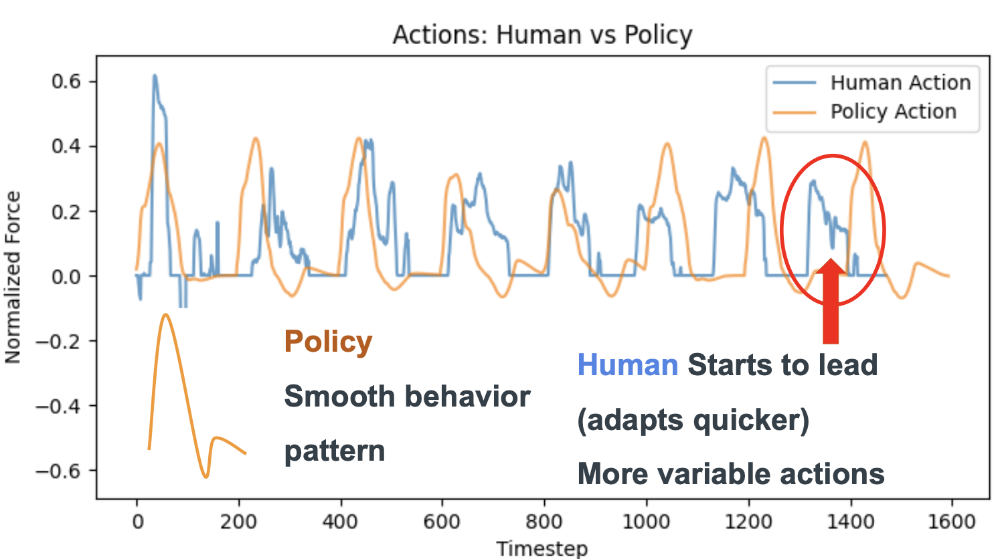
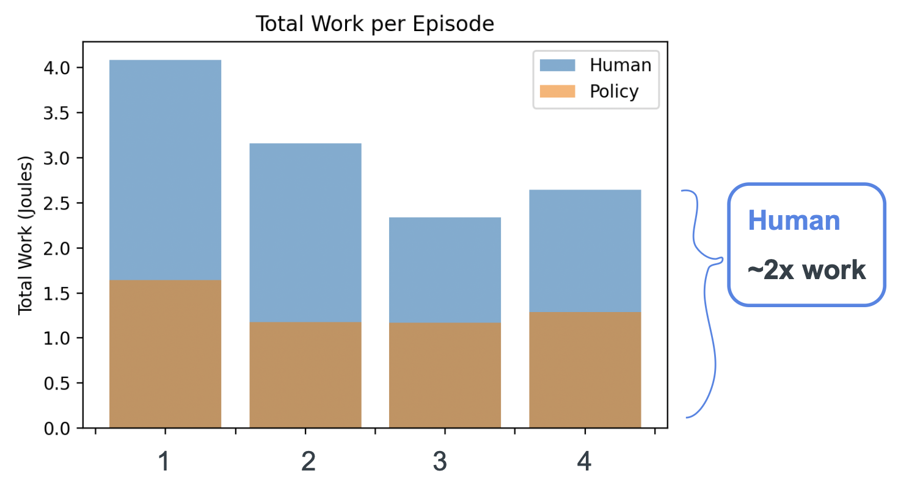

# TeleOp-BC
TeleOp-BC is an imitation learning project that trains a behavioral cloning policy for a MuJoCo box-pushing task from human teleoperation demonstrations. It combines simulation, teleoperation, supervised policy learning, and rollout analysis into one end-to-end workflow.

---

## Demo
Run the full pipeline from demonstration collection to learned-policy deployment:

<div style="display: flex; flex-direction: column; align-items: center; gap: 16px;">
  <p><strong>Training Demo (Human Teleoperation)</strong></p>
  
  <p><strong>Policy Demo (Autonomous Rollout)</strong></p>
  
</div>

```bash
cd src

# 1) Collect demonstrations (keyboard or MediaPipe)
python teleop.py --control mediapipe --episodes 10 --render-mode human --show-hand-debug

# 2) Train behavior cloning policy
python train_bc.py

# 3) Roll out trained policy
python teleop.py --control policy --policy-path data/policy.pt --episodes 4 --render-mode human

# 4) Generate evaluation charts
python evaluation.py
```

All commands above run from `src/`, so generated artifacts are written to `src/data/`.

---

## Abstract
This repository explores how well a lightweight MLP can clone human control behavior in a continuous-control manipulation setting. Human demonstrations are collected with keyboard or hand-gesture teleoperation, then used to train a behavior cloning model that predicts normalized force commands. The trained policy is evaluated against human input using force-time profiles and mechanical work across episodes.

---

## Results
### Force Comparison: Human vs Policy


The policy force signal is noticeably smoother over time, while human teleop applies more variable and reactive corrections.

### Work Comparison: Human vs Policy


Across evaluation rollouts, human control uses roughly 2x more total work than the policy, indicating the learned controller is more energy-efficient for this task.

---

## System Architecture
TeleOp-BC is organized into three connected layers:

1. Simulation environment layer (`src/boxpush.py`, `src/boxpush.xml`):
- MuJoCo + Gymnasium environment with a 1D slider block and randomized target location.
- Observation: `[block_position, block_velocity, relative_distance_to_target]`.
- Action: normalized scalar force in `[-1, 1]`, scaled internally by `Fmax = 10 N`.

2. Teleoperation and rollout layer (`src/teleop.py`):
- Keyboard control for discrete left/right force commands.
- MediaPipe hand-tracking control using thumb-index pinch distance mapped to continuous force.
- Policy mode for autonomous rollouts from a saved checkpoint.
- Saves rollout data to `data/*.npy` relative to the current working directory.

3. Learning and evaluation layer (`src/train_bc.py`, `src/evaluation.py`):
- MLP policy: `3 -> 64 -> 64 -> 1` with `tanh` output.
- Observation normalization with saved mean/std in checkpoint.
- Evaluation scripts compare human vs policy force patterns and per-episode work.

---

## Hardware
- Compute: standard laptop/desktop CPU is sufficient for this task.
- Keyboard for baseline teleoperation input.
- Webcam for MediaPipe hand-gesture teleoperation input.

---

## Software Stack
- Python 3.12
- MuJoCo
- Gymnasium
- PyTorch
- MediaPipe
- OpenCV
- Pygame
- NumPy
- Matplotlib

---

## Key Concepts
- Imitation learning from teleoperation trajectories.
- Observation normalization for stable behavior cloning training/inference.
- Multi-modal teleoperation interfaces (keyboard and vision-based gestures).
- Action smoothness and energy/work as policy quality indicators.

---

## Setup
```bash
git clone https://github.com/cadenpage/TeleOp-BC
cd TeleOp-BC

conda env create -f src/environment.yaml
conda activate bc

cd src
python -c "import mujoco, torch, mediapipe, cv2, pygame; print('setup ok')"
```

---

## Challenges
- Human teleop data quality: demonstrations can be noisy and inconsistent, which directly impacts cloning quality.
- Domain realism vs simplicity: keeping the task simple enough for rapid iteration while preserving meaningful control dynamics.
- Control smoothness: policy outputs can be smoother than human inputs, but this can trade off with fast adaptation in some trajectory segments.

---

## Future Work
- Extend from 1D pushing to higher-dimensional manipulation tasks.
- Add sequence models (for example, temporal conv/transformer policies) for improved behavior prediction.
- Introduce richer evaluation metrics (success rate, settling time, energy-normalized task completion).
- Transfer the policy stack from simulation toward real robot teleoperation workflows.

---

## Repository Layout
```text
TeleOp-BC/
├── README.md
├── imgs/
│   ├── training_demo.gif
│   ├── policy_demo.gif
│   ├── force_comparison.png
│   └── work_comparison.png
├── data/
└── src/
    ├── boxpush.py
    ├── boxpush.xml
    ├── teleop.py
    ├── train_bc.py
    ├── evaluation.py
    └── environment.yaml
```
